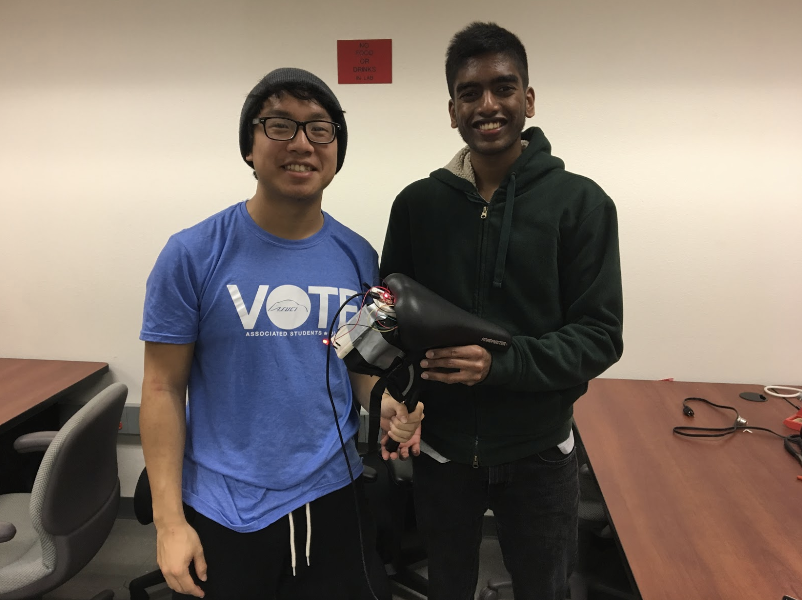
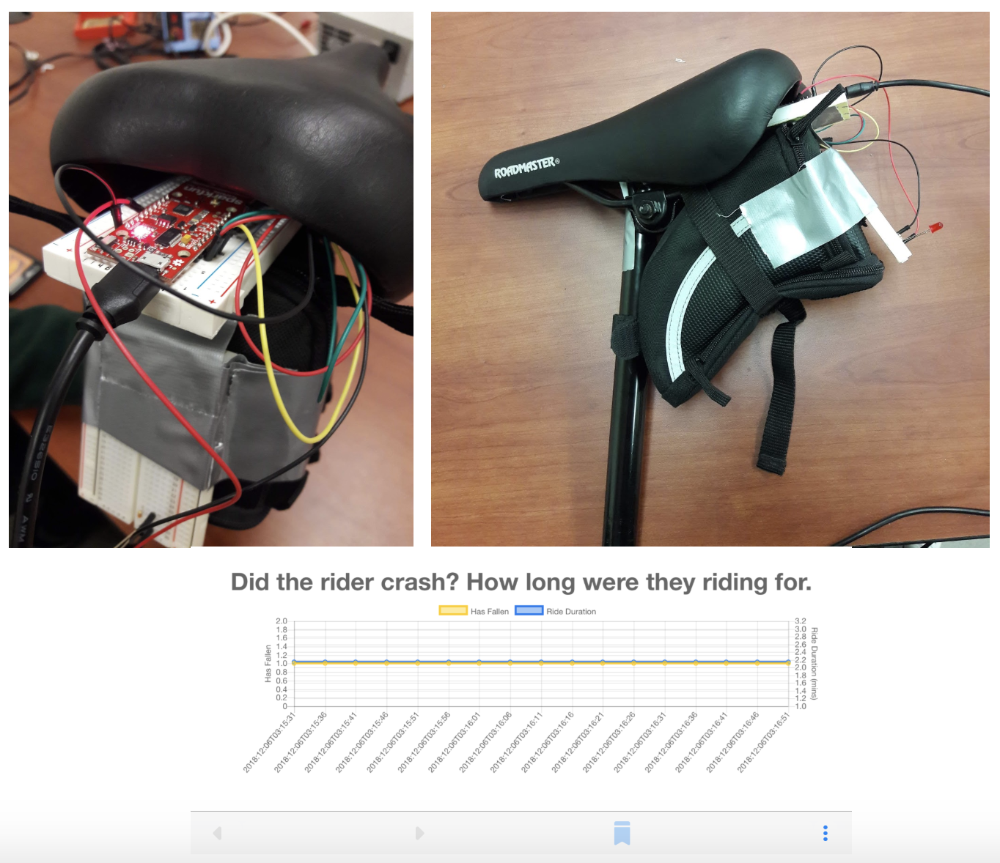

# Smart Bike Seat

People value safety that is non-intrusive and reliable. As bikers, we wanted to create a device that caters to the user’s safety, especially in potentially dangerous situations. The Smart Bike Seat provides statistics based on a user’s biking time, adds functional brake lights minimizing biking danger in the dark, and can send an immediate distress signal should the user crash and is knocked out. 

Our device reads Gyroscope and Accelerometer data from the LSMD6S3 in conjunction to using the Sparkfun ESP8266 Thing Dev to send data and alerts to a cloud server interfaced with Microsoft Azure. Users of the Azure Web App will be notified when a biker with our device is in danger. 

Want the main code? [Click Here](hw/cs190_final_project_iot_hub/app/app.ino)

The Accelerometer returns readings that measure the rate of acceleration in the X, Y, and Z axis. The Gyroscope returns readings that measure the velocity in the X, Y, and Z axis. We used the accelerometer to notice when deceleration occurs to turn on the brake light. The Gyroscope readings allowed us to measure the speed at which the bike has tilted. A drastic tilt constitutes a crash, in which a distress signal is sent via the user’s hotspot on their phone and the brake lights are turned on indefinitely to attract attention. 

After experimenting with the accelerometer to get the brake light functioning we moved on to implement crash detection via the Gyroscope. Initially we had out LSM6DS3 hooked up to the Arduino Uno. Since we were unable to figure out how to send data via BLE to the cloud we opted to use the Sparkfun ESP8266 Thing Dev instead which has WiFi capabilities (with the plan to use a user’s hotspot as a bridge to the cloud). In order to quantify the correct thresholds that would classify whether the gyroscope was tilted with enough speed to constitute a crash, we created a function that collects several gyroscope readings (from the X, Y, and Z axis) from simulated crashes we performed.

When a crash is detected, a timestamp of when the crash occurred relative to when the user started biking is saved and both the crash time and crash message is uploaded onto and Azure Webapp where it can be viewed online on the cloud. The webapp is updated on 10-15 second intervals displaying whether the bike has crashed or not and if so how long ago it happened.

An additional tool we used in our code was calibrating the accelerometer and gyroscope every 10 seconds. This was done so that changes in a user’s biking pattern can be accomodated and normalized. Although we used this, it had little effect on the project. The gyroscope and accelerometer do not measure spatial orientation, just the speed and acceleration respectively the user is biking at a particular time. If the user stops accelerating, then acceleration data read from the accelerometer is effectively zero on all axis (a normalization in itself for our purposes). Gyroscope data is specifically measured from the X axis, which produces numbers that represent a bikes tilt speed (generally soft, but crashes are hard). Calibrating the tilt isn’t that useful because bikes balance on a miniscule range of tilt degrees ie. bikes bike upright.

A particular struggle we faced was interfacing the SparkFun ESP8266 Thing Dev to the Azure Webapp. Azure does not have simple documentation on how to deploy a webapp. Visualizing our data on Azure had a big learning curve and deploying the webapp was long and tedious. CODING IS THE EASY PART.

